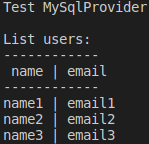

# MySqlProvider

**MySqlProvider** &mdash; это класс на языке программирования C#, предназначенный для подключения к базе данных MySQL, а также реализации отправки SQL-запросов и получения данных.

## Цель

1. Написать класс на языке программирования C# и используя технологию ADO.NET, реализующий подключение к базе данных MySQL, а также реализующий отправку SQL-запросов и получения данных.

## Задачи

1. Изучить технологию ADO.NET;
2. Написать класс, реализующий подключение к базе данных MySQL;
3. Написать методы, реализующие отправку SQL-запросов и получение данных;
4. Реализовать вывод ошибок в журнал;
5. Реализовать настройку работы с классом с помощью файла конфигурации.

## Текущая версия: 0.1.0

## Автор

Роголев Дмитрий Александрович

## Контакты автора

Email: drogolev@internet.ru

Блог автора: https://rogolev.blog/

Вконтакте: https://vk.com/dmitryrogolev

## Инструкция по установке

    1. Клонируйте репозиторий с классом в свой проект 
       git clone https://github.com/dmitry-rogolev/MySqlProvider.git 

    2. Добавьте зависимость из NuGet.org 
       dotnet add package MySql.Data --version 8.0.29

    3. Внесите изменения в атрибут connectionString тега add в файле config/App.config в соответствие с вашими параметрами подключения к базе данных

## Пример использования

    using System;
    using System.Configuration;
    using MySql.Data.MySqlClient;

    namespace MySqlProvider
    {
        public class Program
        {
            public static void Main()
            {
                Console.WriteLine("Test MySqlProvider");

                MySqlProvider provider = new MySqlProvider(ConfigurationManager.ConnectionStrings["MySqlClientProvider"].ConnectionString);
                string query = "CREATE TABLE IF NOT EXISTS `user` ( `id` BIGINT NOT NULL AUTO_INCREMENT PRIMARY KEY, `name` TINYTEXT NULL, `email` TINYTEXT NULL ) CHARSET 'utf8mb4' COLLATE 'utf8mb4_unicode_ci';";
                provider.Execute(query);

                query = "INSERT INTO `user` ( `name`, `email` ) VALUES ( 'name1', 'email1' ), ( 'name2', 'email2' ), ( 'name3', 'email3' );";
                provider.Execute(query);

                query = "SELECT * FROM `user`;";
                MySqlDataReader dr = provider.Query(query);

                Console.WriteLine();
                Console.WriteLine("List users:");
                Console.WriteLine("--------------");
                Console.WriteLine(" name | email");
                Console.WriteLine("--------------");

                while (dr.Read())
                {
                    Console.WriteLine(dr["name"] + " | " + dr["email"]);
                }
            }
        }
    }

### Результат

## Полезная литература

1. Строка подключения (connectionString) 

    https://metanit.com/sharp/adonetcore/2.1.php 

2. SqlDataReader 

    https://docs.microsoft.com/ru-ru/dotnet/api/system.data.sqlclient.sqldatareader?view=netframework-4.8 

3. MySql.Data.MySqlClient 

    https://dev.mysql.com/doc/dev/connector-net/8.0/api/data_api/MySql.Data.MySqlClient.html 

4. MySqlDataReader 

    https://dev.mysql.com/doc/dev/connector-net/8.0/api/data_api/MySql.Data.MySqlClient.MySqlDataReader.html 
